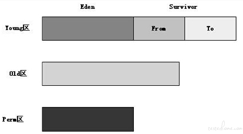
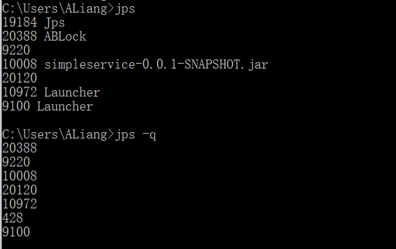
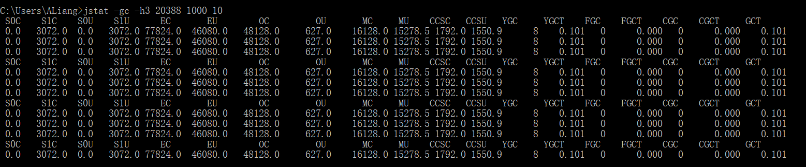
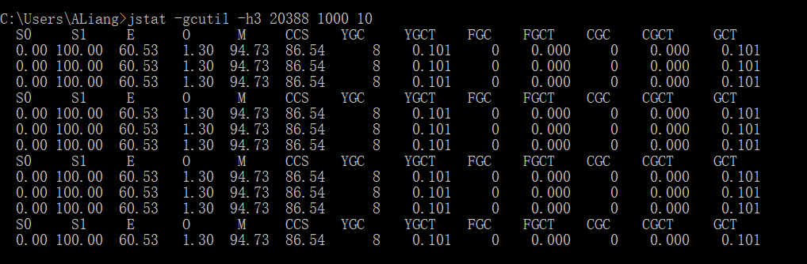
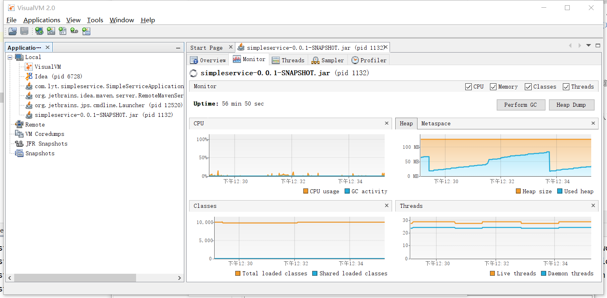
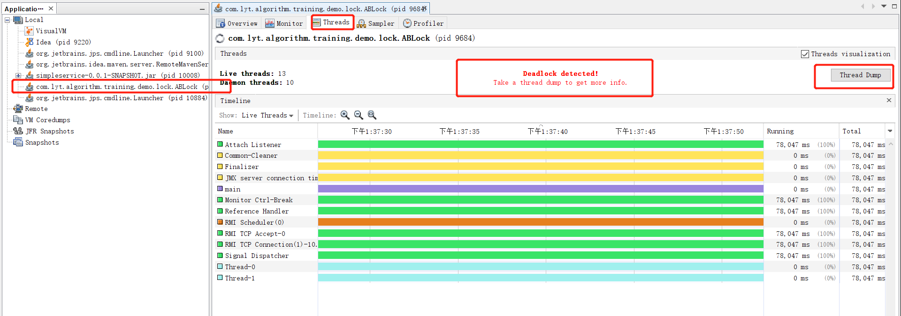
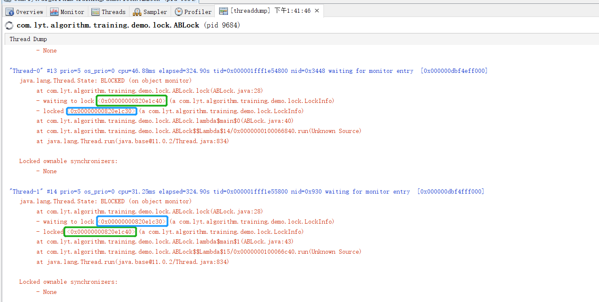
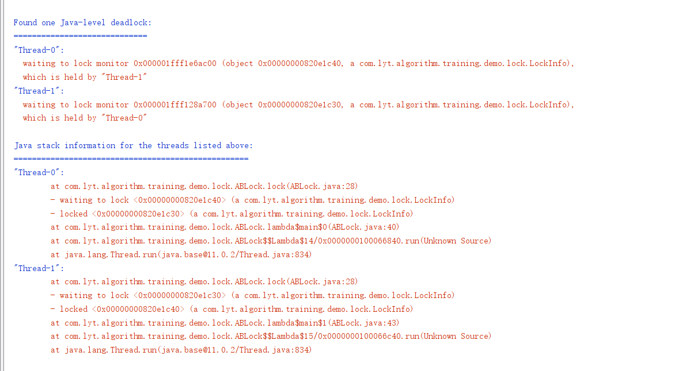
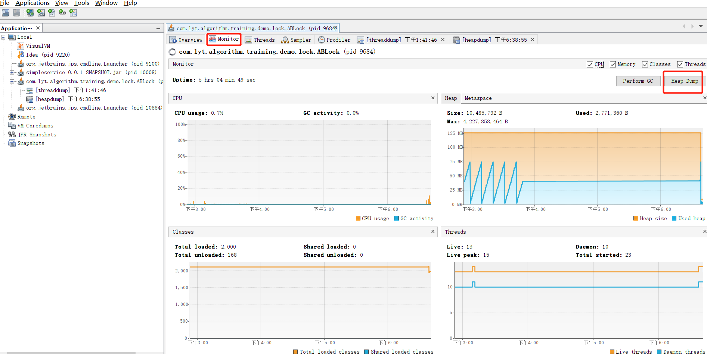
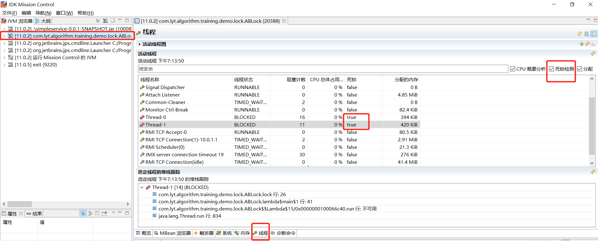

# java学习知识点整理

## 1、java类库

### 泛型之-协变&逆变

#### 协变

```java
    List<? extends Food> foodList = new ArrayList<>();
    List<Apple> appleList = new ArrayList<>();
    foodList = appleList; // ok 协变
    
    foodList.add(new Beef()); // 错误 不能执行添加null 以外的操作
    foodList.add(new Food());// 错误，同上，
    foodlist.add(new Apple()); // 错误，同上
    
    Food food = foodList.get(index); //ok, 把子类引用赋值给父类显然是可以的
```

<？ extends Food> 指明了上界，即表示了集合中存放的对象是 Food 或者Food 的子类，因此foodList 就表示了一个存放 Food 或者Food 的子类的集合，appleList 集合就是一个存放Food 的子类 Apple的集合， 因此可以把 appleList 赋值给 foodList,但是不能对foodList 添加除null 以外的任何对象。为什么不能添加呢？其实很简单，如果可以允许的话，那么foodList 就可以添加Food 或者Food 的子类型，那么上面代码中在foodList = appleList; 赋值后，执行foodList.add(new Beef()); 操作就会导致给 appleList 里面添加了一个Beef 对象，显然这样是不对的。

#### 逆变

```java
    List<? super Fruit> fruitList = new ArrayList<>();
    List<Food> foodList = new ArrayList<>();
    fruitList = foodList; // ok 逆变
    
    foodList.add(new Meat()); 
    
    fruitList.add(new Apple()); // ok，只能添加 Fruit 或者 其子类
    fruitList.add(new Food());// error, 只能添加 Fruit 或者 其子类
    
    Fruit fruit = fruitList.get(0); // error，get出来的元素是Object类型
    Object obj = fruitList.get(0)；// ok 
```


通过<? super Fruit> 指明了下界，即表示了集合中存放的对象只能是 Fruit 或者其父类，因此fruitList 表示了一个存放Fruit 或者其父类的集合，那么就可以把一个Fruit 父类Food 的集合foodList 赋值给 fruitList(即：fruitlist = foodList)，这儿可能有的人就有点疑问了？<? super Fruit> 指明了集合存放的对象是Fruit 或者其父类,那为什么往集合中添加Fruit的父类元素不行呢（fruitList.add(new Food())）？同样我们用反正法来说明，假如可以向<? super E> 集合中添加 E 的父类，那么就可以向fruitList 添加Fruit 的父类（Food or Object)，在本例中，我们把foodList 赋值给了fruitList(fruitList = foodList),既然可以添加父元素，那么我们执行fruitList.add(new Food) 就相当于给 foodList集合里面添加了一个Food元素，这看起来没有什么问题，因为foodList 本来就是用来装Food 元素的，但是如果我们添加的Fruit 父类是Object 对象（或者一个Fruit 实现的和Food 无关的接口，又或者Food继承的一个其他类B,那么B也是 Fruit 的父类），那么就意味着给foodList 里面添加了和Food 无关的类，这样显然是不行的。那么为什么往fruitList 里面添加Fruit或者其子类 元素是可以的，因为fruitList 表示的就是一个存放Fruit 或者其父类的集合，所以这个集合肯定就能装Fruit 或者其子类，比如上面把foodList 赋值给fruitList 后，往fruitList 里面添加 Apple 就相当于往foodList 里面添加Apple,显然是可以的，对于get 操作时为什么读取出来的是Object ，是因为 fruitList 集合表示的存放Fruit 或者其父类的集合，而Fruit 的父类可能有很多，在本例中由于我们知道存的是Food（fruitList = foodList）, 但是在实际中，谁知道在运行时到底存的是哪一个呢？因此为了安全全部定义为Object 类型。因此得出结论：

通过<? super E> 支持逆变，能往集合中添加E 或者E子类的对象。不能添加E的任何父类对象，读取时的对象为Object 类型。


【参考】Java 泛型之-协变&逆变

https://blog.csdn.net/Just_keep/article/details/79482365

## 2、内存模型

### 2.1 分代垃圾收集



JVM将整个堆划分为Young区、Old区和Perm区，分别存放不同年龄的对象，这三个区存放的对象有如下区别。
Young区又分为Eden区和两个Survivor区，其中所有新创建的对象都在Eden区，当Eden区满后会触发young GC将Eden区仍然存活的对象复制到其中一个Survivor区中，另外一个Survivor区中的存活对象也复制到这个Survivor中，以保证始终有一个Survivor区是空的。

Old区存放的是Young区的Survivor满后触发young GC后仍然存活的对象，当Eden区满后会将对象存放到Survivor区中，如果Survivor区仍然存不下这些对象，GC收集器会将这些对象直接存放到Old区。如果在Survivor区中的对象足够老，也直接存放到Old区。如果Old区也满了，将会触发Full GC，回收整个堆内存。

Perm区存放的主要是类的Class对象，如果一个类被频繁地加载，也可能会导致Perm区满，Perm区的垃圾回收也是由Full GC触发的。

Young区存放所有新生成的对象，Perm区用于存放静态文件，如Java类、方法等。
Old区都是一些生命周期较长的对象，所以年老代收集频率不像年轻代那么频繁，这样就减少了每次垃圾收集时所要扫描的对象的数量，从而提高垃圾回收效率。
在新生代中，由于对象生存期短，每次回收都会有大量对象死去，那么这时就采用复制算法。老年代里的对象存活率较高，没有额外的空间进行分配担保，所以可以使用标记-整理 或者 标记-清除。

扩展阅读：
jstat分析java内存回收机制理解
https://testerhome.com/topics/11996?locale=zh-CN


## 3、网络编程

### URL&URI

URL是一种URI

URL与URI的区别和联系

https://www.cnblogs.com/polary/p/11795013.html

## 4 JDK调试定位能力

[java8官网文档](https://docs.oracle.com/javase/8/docs/technotes/tools/windows/)

【搞定Jvm面试】 JDK监控和故障处理工具揭秘

https://blog.csdn.net/qq_34337272/article/details/103644552

### 4.1 常用JDK命令行工具

这些命令在 JDK 安装目录下的 bin 目录下：

#### 4.1.1 jps (JVM Process Status）

类似 UNIX 的 ps 命令。用户查看所有 Java 进程的启动类、传入参数和 Java 虚拟机参数等信息；

- jps：显示虚拟机执行主类名称以及这些进程的本地虚拟机唯一 ID（Local Virtual Machine Identifier,LVMID）。

- jps -q ：只输出进程的本地虚拟机唯一 ID。
    
    

- jps -l:输出主类的全名，如果进程执行的是 Jar 包，输出 Jar 路径。
    ```shell script
    C:\Users\ALiang>jps -l
    20388 com.lyt.algorithm.training.demo.lock.ABLock
    21396 jdk.jcmd/sun.tools.jps.Jps
    9220
    10008 .\simpleservice-0.0.1-SNAPSHOT.jar
    20120
    10972 org.jetbrains.jps.cmdline.Launcher
    9100 org.jetbrains.jps.cmdline.Launcher
    ```

- jps -v：输出虚拟机进程启动时 JVM 参数。

- jps -m：输出传递给 Java 进程 main() 函数的参数。

java8官网
https://docs.oracle.com/javase/8/docs/technotes/tools/windows/jps.html

#### 4.1.2 jstat（ JVM Statistics Monitoring Tool）

jstat（JVM Statistics Monitoring Tool） 使用于监视虚拟机各种运行状态信息的命令行工具。 它可以显示本地或者远程（需要远程主机提供 RMI 支持）虚拟机进程中的类信息、内存、垃圾收集、JIT 编译等运行数据，在没有 GUI，只提供了纯文本控制台环境的服务器上，它将是运行期间定位虚拟机性能问题的首选工具。

jstat 命令使用格式：

    jstat -<option> [-t] [-h<lines>] <vmid> [<interval> [<count>]]

比例 jstat -gc -h3 20388 1000 10 表示分析进程 id 为 20388 的 gc 情况，每隔 1000ms 打印一次记录，打印 10 次停止，每 3 行后打印指标头部。




-gcutil



其中
- S0C：年轻代中第一个survivor（幸存区）的容量 (字节) 
- S1C：年轻代中第二个survivor（幸存区）的容量 (字节) 
- S0U：年轻代中第一个survivor（幸存区）目前已使用空间 (字节) 
- S1U：年轻代中第二个survivor（幸存区）目前已使用空间 (字节) 
- EC：年轻代中Eden（伊甸园）的容量 (字节) 
- EU：年轻代中Eden（伊甸园）目前已使用空间 (字节) 
- OC：Old代的容量 (字节) 
- OU：Old代目前已使用空间 (字节) 
- PC：Perm(持久代)的容量 (字节) 
- PU：Perm(持久代)目前已使用空间 (字节) 
- YGC：从应用程序启动到采样时年轻代中gc次数 
- YGCT：从应用程序启动到采样时年轻代中gc所用时间(s) 
- FGC：从应用程序启动到采样时old代(全gc)gc次数 
- FGCT：从应用程序启动到采样时old代(全gc)gc所用时间(s) 
- GCT：从应用程序启动到采样时gc用的总时间(s) 
- NGCMN：年轻代(young)中初始化(最小)的大小 (字节) 
- NGCMX：年轻代(young)的最大容量 (字节) 
- NGC：年轻代(young)中当前的容量 (字节) 
- OGCMN：old代中初始化(最小)的大小 (字节) 
- OGCMX：old代的最大容量 (字节) 
- OGC：old代当前新生成的容量 (字节) 
- PGCMN：perm代中初始化(最小)的大小 (字节) 
- PGCMX：perm代的最大容量 (字节)   
- PGC：perm代当前新生成的容量 (字节) 
- S0：年轻代中第一个survivor（幸存区）已使用的占当前容量百分比 
- S1：年轻代中第二个survivor（幸存区）已使用的占当前容量百分比 
- E：年轻代中Eden（伊甸园）已使用的占当前容量百分比 
- O：old代已使用的占当前容量百分比 
- P：perm代已使用的占当前容量百分比 
- S0CMX：年轻代中第一个survivor（幸存区）的最大容量 (字节) 
- S1CMX ：年轻代中第二个survivor（幸存区）的最大容量 (字节) 
- ECMX：年轻代中Eden（伊甸园）的最大容量 (字节) 
- DSS：当前需要survivor（幸存区）的容量 (字节)（Eden区已满） 
- TT： 持有次数限制 
- MTT ： 最大持有次数限制 

理解说明

1) O过大说明内存即将不足

1) P过大说明不断的有类频繁加载，

1) O和P的回收只能靠Full GC


jstat分析java内存回收机制理解
https://testerhome.com/topics/11996?locale=zh-CN
Jstat各参数含义
http://blog.sina.com.cn/s/blog_71a961ab0102xgju.html


java8官网
https://docs.oracle.com/javase/8/docs/technotes/tools/windows/jstat.html

#### 4.1.3 jinfo (Configuration Info for Java) 


#### 4.1.4 jmap (Memory Map for Java)

生成堆转储快照;

#### 4.1.5 jhat (JVM Heap Dump Browser ) 

用于分析heapdump文件，它会建立一个HTTP/HTML服务器，让用户可以在浏览器上查看分析结果;

#### 4.1.6 jstack (Stack Trace for Java)

生成虚拟机当前时刻的线程快照，线程快照就是当前虚拟机内每一条线程正在执行的方法堆栈的集合。


### 4.2 Java VisualVM

Java VisualVM是一个工具，它提供有关在Java虚拟机上运行的代码的信息。

jdk11以后Java VisualVM不再与JDK捆绑在一起，但您可以从[VisualVM开源项目站点](https://visualvm.github.io/)获取它。

#### 4.2.1 下载安装

从VisualVM开源项目站点(https://visualvm.github.io/)获取最新版本。

手动执行visualvm.exe或者安装idea插件启动visualvm。
它能够使用 Java 发现协议（JDP）自动地发现本地和远程运行的 Java 进程。




Jvisualvm功能介绍

https://www.cnblogs.com/mzq123/p/11166640.html

jdk自带监控程序jvisualvm的使用

https://blog.csdn.net/u012550080/article/details/81605189

#### 4.2.2 线程死锁分析

1) 死锁代码
    ```java
        public static boolean lock(String user, Object left, Object right) {
            synchronized (left) {
                System.out.println(user + " lock " + left + " success");
                sleep(3);
                synchronized (right) {
                    System.out.println(user + " lock " + left + " success");
                    sleep(3);
                    lockSuccesNum.incrementAndGet();
                    return true;
                }
            }
        }
    ```
1) 启动visualvm，可以看出已经帮我们检测出死锁，获取线程快照。

    

1) 线程快照分析

    线程信息
    
    
    死锁信息
    


#### 4.2.3 内存分析

1) 获取内存快照

    

### 4.3 JMC(Java Mission Control)

JDK Mission Control 是一个用于对 Java 应用程序进行管理、监视、概要分析和故障排除的工具套件。

#### 4.3.1 下载安装

开源地址 https://openjdk.java.net/projects/jmc/7/

下载：https://jdk.java.net/jmc/

通过双击启动jmc.exe即可，它能够使用 Java 发现协议（JDP）自动地发现本地和远程运行的 Java 进程。

Java性能调优：利用JMC分析性能

https://blog.csdn.net/h254532699/article/details/54342511/

#### 4.3.2 线程死锁检测




### 4.4 远程调试

java启动参数配置如下：

#### 4.4.1 方式1 
    
    -Xdebug -Xrunjdwp:transport=dt_socket,server=y,suspend=n,address=8000

- -Xdebug：通知JVM工作在debug模式下；

- -Xrunjdwp：通知JVM使用(java debug wire protocol)来运行调试环境；

#### 4.4.2 方式2

    -agentlib:jdwp=transport=dt_socket,server=y,suspend=n,address=*:8000

